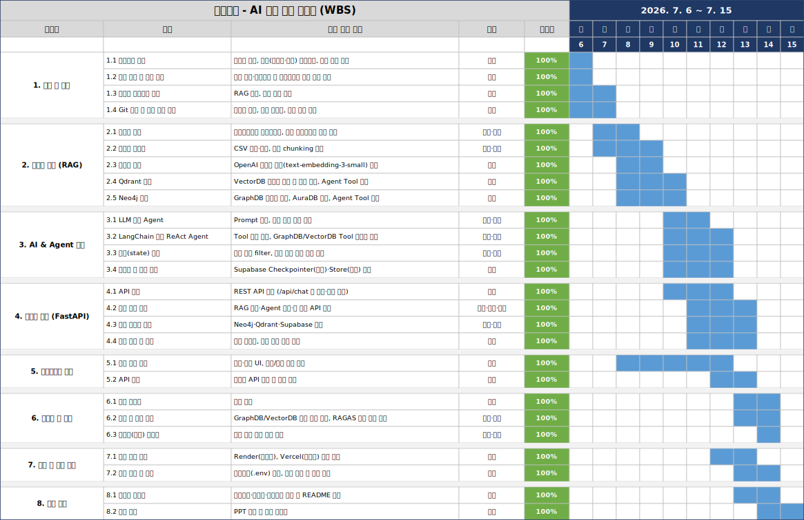
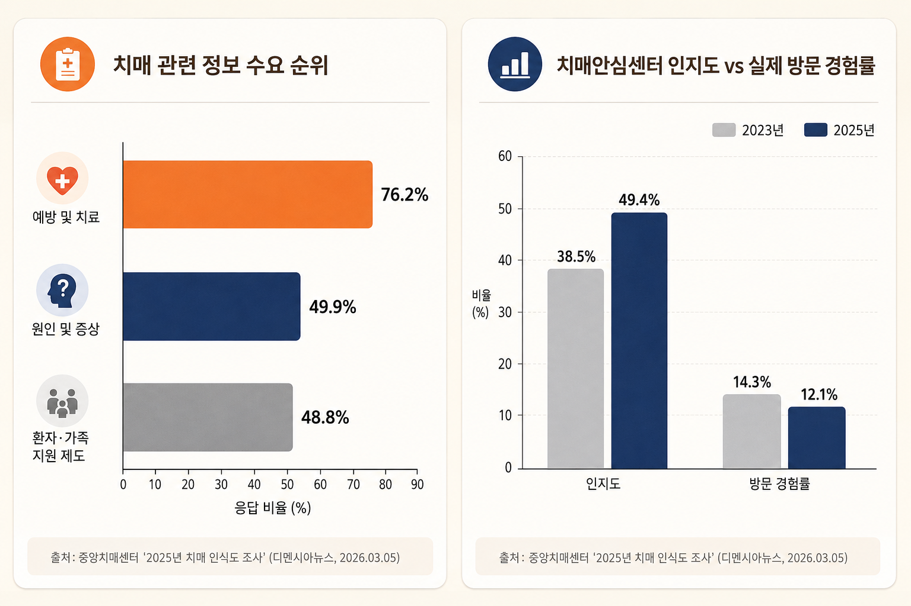

# SKN31-3rd-1Team

# 1. 팀 및 팀원 소개

### 1.1 팀 명
<!-- TODO -->
#### **Team: 📋 건망검진**

### 1.2 팀원 및 담당업무
| 유진영 | 안영선 | 박연아 | 김효민 | 김동민 |
| :---: | :---: | :---: | :---: | :---: |
| <a href="https://github.com/ujneg18-source"></a> | <a href="https://github.com/dksdudtjs94"></a> | <a href="https://github.com/yeona9549"></a> | <a href="https://github.com/hyomin0357"></a> | <a href="https://github.com/Uranium10"></a> |
|  |  |  |  |  |
| **PM · GraphDB 설계**<br><sub>데이터 수집 및 전처리</sub><br><sub>Agent Tool 개발</sub> | **VectorDB 설계**<br><sub>데이터 수집 및 전처리</sub><br><sub>Agent Tool 개발</sub> | **백엔드**<br><sub>LangGraph·AI Agent 설계</sub><br><sub>프롬프트 엔지니어링</sub> | **백엔드**<br><sub>LangGraph·AI Agent 설계</sub><br><sub>프롬프트 엔지니어링</sub> | **프론트엔드**<br><sub>웹 UI 구현 (챗봇 인터페이스)</sub><br><sub>백엔드 API 연동</sub> |


### 1.3 기술 스택 🛠

<p>


<br><br>


</p>


---

### 1.4 WBS

<div align="center">

</div>


---

## 2. 프로젝트 개요

### 2.1 프로젝트명
- AI 치매 정보 알리미
- https://dementia-front.vercel.app/

### 2.2 프로젝트 소개

- <b>AI 치매 정보 알리미</b>는 치매가 걱정되는 보호자를 대상으로, <b>전국 치매안심센터 정보</b>(GraphDB)와 <b>치매 조기검진·증상 가이드라인 문서</b>(VectorDB)를 결합한 <b> RAG 기반 챗봇</b>을 개발하는 프로젝트입니다.

- 보호자가 증상을 설명하면 관련 VectorDB에 적재된 가이드라인을 근거로 안내하고, 거주 지역을 알려주면 가까운 치매안심센터의 위치·운영기관·제공 프로그램 정보를 GraphDB에 기반하여 제공합니다. 

- <b>LangGraph 기반 AI 에이전트</b>가 질문 내용에 따라 GraphDB/VectorDB 조회하여 tool을
스스로 판단해 호출하는 구조로 구현했습니다. 정적인 체인(LCEL) 대신,
LLM과 tool이 답이 나올 때까지 왕복하는 <b>ReAct 에이전트</b> 루프를 사용했습니다.

- ① 생각(Reasoning) → ② 행동(Acting, tool 호출) → ③ 관찰(Observation, 결과 확인) → ④ 재판단(1번으로 반복 여부 결정) → ⑤ 최종 답변

### 2.3 배경 및 선정 이유

<div align="center">

</div>


- 국내 치매 환자 수는 <b>2026년 100만 명</b>을 돌파2하며 2044년에는 200만 명을 넘어설 것으로 전망된다. 치매는 더 이상 일부의 문제가 아니라 우리 사회 전체가 마주할 과제가 되었다.

- 중앙치매센터의 '2025년 치매 인식도 조사'(전국 성인 1,200명 대상)를 보면, '아는 것'과 '실제 이용'은 전혀 다른 이야기였다. <b>치매안심센터 인지도는 49.4%</b>이며, 실제 방문 경험률은 12.1%로 오히려 낮아졌다. 치매에 대한 지식은 조금씩 확산되고 있지만, 실제 공존과 이용으로는 잘 이어지지 않고 있는 것이다.

- 또한 국민이 가장 필요로 하는 <b>정보는 예방 및 치료(76.2%), 원인 및 증상(49.9%) </b>순으로 조기 대응에 대한 수요는 명확하다. 이에 본 프로젝트는 치매 초기 증상 정보에 대한 접근성을 높이고, 필요한 순간 가까운 치매안심센터로 자연스럽게 연결해주는 챗봇 '치매알람'을 기획하게 되었다.
               
### 2.4 주요 기능 및 요구사항

- 전국 치매안심센터 데이터를 <b>GraphDB</b>로 구조화해 지역/운영기관/프로그램 기준 조회 제공
- 치매 조기검진·증상 관련 가이드라인 문서를 <b>VectorDB</b>로 임베딩해 의미 기반 검색 제공
- <b>AI 에이전트</b>가 사용자 질문에 따라 GraphDB/VectorDB tool을 스스로 호출해 답변 생성
- Supabase 기반 단기(세션)/장기(사용자별) 대화 상태 관리


## 3. 디렉토리 구조

```
SKN31-3nd-1Team/
├── .env                         # 환경변수 (API 키, DB 접속 정보 — git 미포함)
├── .gitignore
├── config.py                    # 프로젝트 전역 설정 상수 (모델명, 경로, DB 접속 정보 등)
├── README.md
├── requirements.txt
├── server.bat
├── UVon.bat
│
├── graph_db/                    # GraphDB(Neo4j) 관련 코드
│   ├── __init__.py
│   ├── graph_search_tool.py
│   ├── load_to_aura.py
│   ├── preprocess.py
│   └── data/
│
├── modules/                     # LangGraph 파이프라인 (에이전트, State, 그래프 구성)
│   ├── __init__.py
│   └── agent.py
│
├── server/                      # FastAPI 서버
│   ├── extractor.py
│   ├── family_tool.py
│   ├── main.py
│   ├── server.bat
│   └── state_manager.py
│
├── vector_db/                   # VectorDB(Qdrant) 관련 코드
│   ├── __init__.py
│   ├── run_vector.py
│   └── vector_search_tool.py
│
└── 산출물/                       # 프로젝트 산출물 문서
    ├── 데이터수집및전처리문서.md
    ├── 성능평가.md
    ├── 시스템아키텍쳐.md
    └── images/        
```


---


## 4. 수집 데이터 설명
- [데이터 수집 및 전처리 문서](./산출물/데이터수집및전처리문서.md)
- 문서보고 간략하게 요약


---

## 5. Application의 주요 기능

- [시스템 아키텍처 및 DB 설계](./산출물/시스템아키텍쳐.md)
- 문서보고 간략하게 요약 or 시연영상 or 사진

---

## ６. 성능 평가

- [성능 평가](./산출물/성능평가.md)
- 모델 선정이유 or 문서보고 간략하게 요약


---
## 7. 회고

<!-- TODO -->
#### 구현 중 겪었던 문제와 해결 or 각자 느낀 점

#### 영선
-

#### 동민
-

#### 연아
-

#### 효민
-

#### 진영
-

---
