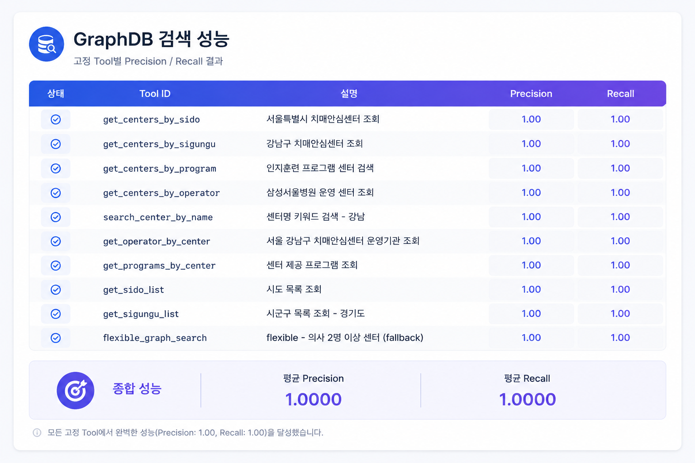
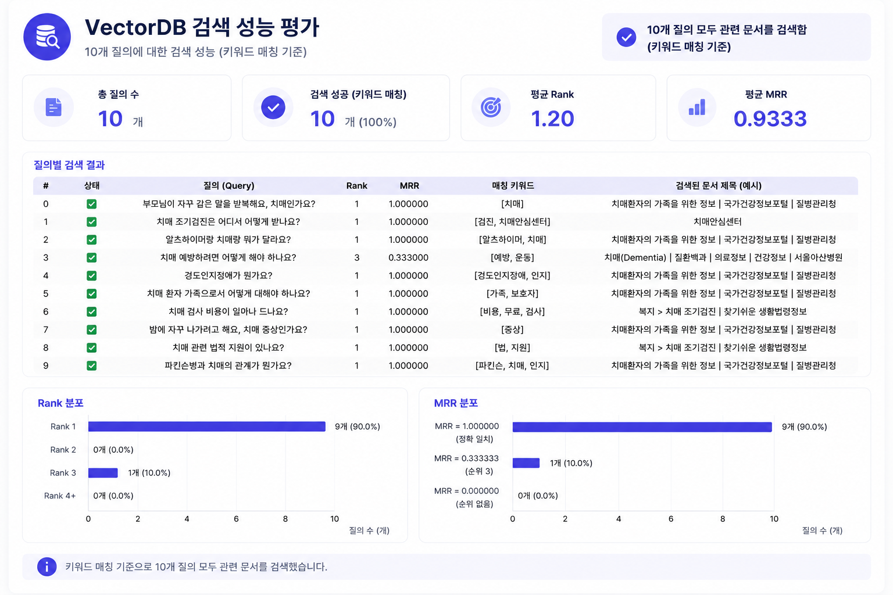
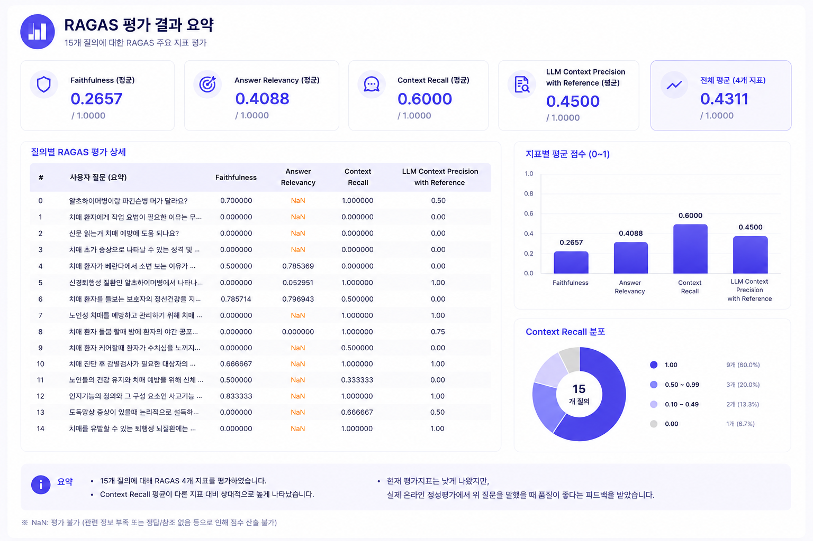
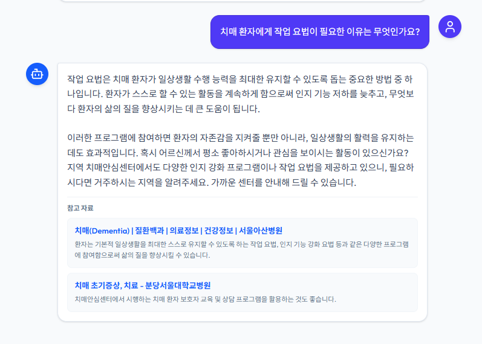
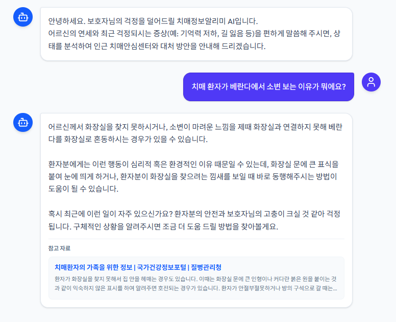
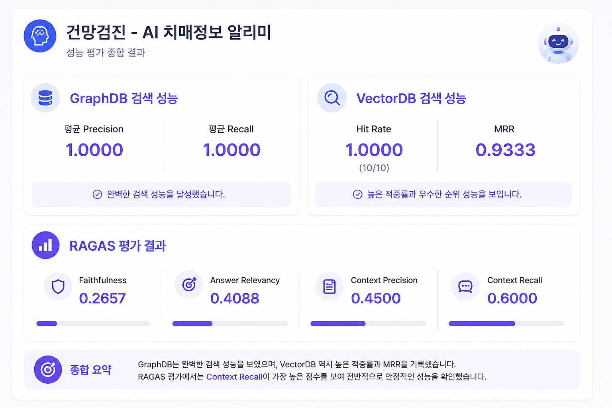

# 성능 평가 
- 작성일: 2026-07-15

## 1. GraphDB 성능 평가

### GraphDB(Neo4j)를 사용한 이유

센터-프로그램-지역-운영기관 간 **다대다 관계**를 다루는 질문이 많아,
JOIN 기반 RDB보다 관계 자체를 1급 시민으로 다루는 GraphDB가 적합하다고 판단.

**예시 질문**
- "강남구에 치매안심센터 몇 개야?" → 지역(시군구)-센터 관계 집계
- "인지훈련 프로그램 하는 센터 어디어디야?" → 센터-프로그램 다대다 관계 탐색
- "삼성서울병원이 운영하는 센터는?" → 운영기관-센터 관계 탐색
- "의사가 2명 이상인 센터는?" → 속성 조건 + 관계 결합 질의

이런 질문들은 RDB로 하면 JOIN 테이블을 여러 개 거쳐야 하지만, GraphDB는
관계를 그대로 순회(traversal)하면 되어 쿼리가 직관적이고 빠름.

### 평가 방법

질의 10개 세트(9개 고정 tool 각 1건 + flexible_graph_search fallback 1건)에 대해
tool 실행 결과 텍스트에 Ground Truth 키워드가 모두 포함되는지로 Precision/Recall 산출.

### 결과

| 질문 | 사용 tool | Precision | Recall | 비고 |
|---|---|---|---|---|
| 서울특별시 치매안심센터 조회 | get_centers_by_sido | 1.0 | 1.0 | ✅ |
| 강남구 치매안심센터 조회 | get_centers_by_sigungu | 1.0 | 1.0 | ✅ |
| 인지훈련 프로그램 센터 검색 | get_centers_by_program | 1.0 | 1.0 | ✅ |
| 삼성서울병원 운영 센터 조회 | get_centers_by_operator | 1.0 | 1.0 | ✅ |
| 센터명 키워드 검색 - 강남 | search_center_by_name | 1.0 | 1.0 | ✅ |
| 서울 강남구 치매안심센터 운영기관 조회 | get_operator_by_center | 1.0 | 1.0 | ✅ |
| 센터 제공 프로그램 조회 | get_programs_by_center | 1.0 | 1.0 | ✅ |
| 시도 목록 조회 | get_sido_list | 1.0 | 1.0 | ✅ |
| 시군구 목록 조회 - 경기도 | get_sigungu_list | 1.0 | 1.0 | ✅ |
| flexible - 의사 2명 이상 센터 (fallback) | flexible_graph_search | 1.0 | 1.0 | ✅ |

**평균 Precision: 1.0000 / 평균 Recall: 1.0000** (10/10)

#### 성능 결과표

#### 코멘트

10개 질의 모두 고정 tool 라우팅 및 fallback 모두 정답 키워드를 정확히 포함해 반환.
9개 고정 tool의 라우팅 로직과 flexible_graph_search fallback 모두 의도대로 동작함을 확인.
---

## 2. VectorDB 성능 평가 (유사도)

### VectorDB(Qdrant)를 사용한 이유

치매 증상/예방 관련 비정형 가이드라인 문서(치매 조기 증상, 대응 방법 등)는
정형화된 관계가 아니라 **의미적 유사도 기반 검색**이 필요해, 임베딩 기반
VectorDB가 적합하다고 판단.

**예시 질문**
- "요즘 자꾸 물건을 어디 뒀는지 까먹어요, 이거 치매 초기 증상인가요?" → 구조화 안 된 자연어 증상 설명을 문서와 의미 매칭
- "부모님이 치매 진단받으면 뭐부터 해야 하나요?" → 특정 키워드 매칭이 아니라 맥락 이해 필요
- "경도인지장애랑 치매랑 뭐가 달라요?" → 개념 설명형 질문, 정확한 텍스트 일치가 아닌 유사 문맥 검색

이런 질문은 GraphDB의 정형 관계 탐색으로는 답할 수 없고, 문서 내용 자체의
의미 유사도로 찾아야 하기 때문에 VectorDB를 병행.

### 평가 방법

질의-정답 키워드 쌍 10개 세트에 대해 top-k 검색 결과 청크에 키워드가 등장하는
첫 순위(rank)를 찾아 Hit Rate / MRR 산출. `SCORE_THRESHOLD=0.3`, `TOP_K=4` 기준.

### 결과

| 지표 | 값 |
|---|---|
| Hit Rate | 1.0000 (10/10) |
| MRR | 0.9333 |

| 질문 | Hit | Rank | MRR |
|---|---|---|---|
| 부모님이 자꾸 같은 말을 반복해요, 치매인가요? | ✅ | 1 | 1.0000 |
| 치매 조기검진은 어디서 어떻게 받나요? | ✅ | 1 | 1.0000 |
| 알츠하이머랑 치매랑 뭐가 달라요? | ✅ | 1 | 1.0000 |
| 치매 예방하려면 어떻게 해야 하나요? | ✅ | 3 | 0.3333 |
| 경도인지장애가 뭔가요? | ✅ | 1 | 1.0000 |
| 치매 환자 가족으로서 어떻게 대해야 하나요? | ✅ | 1 | 1.0000 |
| 치매 검사 비용이 얼마나 드나요? | ✅ | 1 | 1.0000 |
| 밤에 자꾸 나가려고 해요, 치매 증상인가요? | ✅ | 1 | 1.0000 |
| 치매 관련 법적 지원이 있나요? | ✅ | 1 | 1.0000 |
| 파킨슨병과 치매의 관계가 뭔가요? | ✅ | 1 | 1.0000 |

#### 성능 결과표

---

## 3. Model 성능 평가 (RAGAS + 정성평가)

### 3-1. 정량 평가 (RAGAS)

### 평가 방법

RAGAS `TestsetGenerator`로 Qdrant 청크 기반 테스트셋 자동 생성 후,
`get_structured_answer`로 응답을 생성해 Faithfulness, Answer Relevancy,
Context Precision, Context Recall 4개 지표 측정 (testset_size=15 요청, 실행 결과 15개 확보).

### 결과

| 지표 | 점수 |
|---|---|
| Faithfulness | 0.2657 |
| Answer Relevancy | 0.4088 |
| Context Precision | 0.4500 |
| Context Recall | 0.6000 |

#### 성능 결과표

#### 코멘트

평가 결과가 낮게 나와 실제 서비스되는 상황에서 같은 질문으로 평가

### 3-2. 정성 평가

#### 평가 방법

기존에 진행한 **온라인 정성평가** 자료 중 2건을 반영. 실제 배포 환경에서 질문을 입력해 받은
응답을 팀 관점에서 채점. RAGAS 같은 자동 지표가 못 잡는 "실제로 유용한가", "톤이 적절한가"를
확인하는 목적이며, 공교롭게도 이 2건은 RAGAS 정량 평가에서도 낮은 점수가 나온 문항이라
정량-정성 비교 사례로도 같이 활용.

#### 평가 기준 (예시)

| 항목 | 설명 |
|---|---|
| 정확성 | 사실과 다른 내용이 없는가 |
| 유용성 | 실제 사용자(보호자/환자)에게 실질적으로 도움이 되는가 |
| 톤/표현 | 민감한 주제(치매)를 다루는 데 있어 표현이 적절한가 |
| 일관성 | 비슷한 질문에 답변이 오락가락하지 않는가 |

#### 결과

| 질문 | 종합 코멘트 |
|------|------|
| 치매 환자에게 작업 요법이 필요한 이유는 무엇인가요? | 참고자료 2건(서울아산병원, 분당서울대병원) 인용하며 목적·효과를 정확히 설명. 어르신 관심사를 되묻고 지역 센터 연계까지 자연스럽게 제안. RAGAS 점수와 실제 품질이 크게 어긋난 사례 |
| 치매 환자가 베란다에서 소변 보는 이유가 뭐에요? | 화장실 혼동 등 원인을 무리 없이 설명, 표식 부착 등 실행 가능한 대처법 제시. "환자분의 안전과 보호자님의 고충이 크실 것 같다"는 공감 표현 적절. 참고자료 인용 있음 |

#### 코멘트

두 예시 모두 **정량 지표(RAGAS)는 낮았지만 정성적으로는 준수한 답변**

---

## 4. 종합 요약

