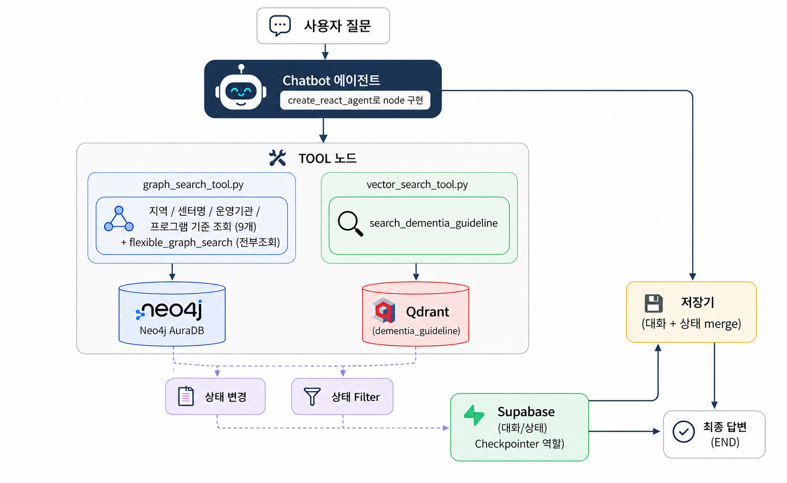

# 시스템 아키텍처 및 DB 설계

## 1. 시스템 아키텍처 구성도

전체 파이프라인은 바깥쪽 `StateGraph`(제너레이터+툴노드+저장기+상태filter를 잇는 그래프) 안에, "Chatbot 에이전트"라는 노드 하나가 `create_react_agent`로 구현되어 들어가는 구조다. `create_react_agent`는 그 자체로 "LLM 판단 → 툴 호출 → 결과 반영 → 재판단" 루프를 내부에 갖고 있는 서브그래프이며, 바깥 `StateGraph`는 이 완성된 서브그래프를 노드 하나로 재사용하고, 그 앞뒤에 저장기·상태filter처럼 팀이 직접 만든 커스텀 노드를 붙인다. 질문 유형에 따라 미리 분기하는 라우터는 없고, Chatbot 에이전트 노드 내부에서 LLM이 매 턴 "지금 툴 호출이 필요한지, 답변을 마무리할지"를 판단한다.

## 2. 컴포넌트 역할

| 컴포넌트 | 역할 |
|---|---|
| Chatbot 에이전트 (node, `create_react_agent`로 구현) | 바깥 `StateGraph`의 노드 하나. 내부적으로 제너레이터(LLM)와 툴노드가 자체 루프를 돈다 — 사용자 입력과 대화 상태를 받아 답변을 생성하거나, 필요하면 GraphDB/VectorDB tool을 스스로 호출하고 결과를 반영해 재판단한다. 시스템 프롬프트로 역할(진단 금지, 근거 기반 답변 등)이 정의된다. |
| 기억 정보 — 단기 (Supabase Checkpointer) | 이번 상담 세션(스레드) 동안의 대화 기록과 슬롯 상태를 저장. 세션이 끝나면 그 자체로는 더 참조되지 않는다. |
| 기억 정보 — 장기 (Supabase, Store) | 세션이 끝나도 남아야 하는 정보(보호자 프로필, 상담 대상자별 증상 이력, 안전신호 이력)를 사용자 단위로 누적 저장한다. |
| 저장기 (대화+상태 merge) | 바깥 `StateGraph`의 노드. 한 턴이 끝날 때 대화 기록과 슬롯 상태(증상/기간 등)를 합쳐 단기 기억에 저장하고, 답변이 완성되었으면 종료(END)로, 슬롯이 더 필요하면 다시 Chatbot 에이전트 노드로 진행 여부를 결정한다. 이때 장기 기억에도 반영이 필요한 항목(증상 이력 등)은 Store에 함께 기록한다. |
| 상태filter / 상태 변경 제안 | 바깥 `StateGraph`의 노드. Chatbot 에이전트가 GraphDB·VectorDB tool로 가져온 정보를 바탕으로 대화 상태(슬롯)를 어떻게 갱신할지 제안하고, 이를 걸러서 Chatbot 에이전트에 다시 전달한다. |

### 2.0 단기 기억 vs 장기 기억

| 구분 | 저장 단위 | 담당 메커니즘 | 담는 내용 | 생명주기 |
|---|---|---|---|---|
| 단기 기억 | thread_id (상담 세션) | LangGraph Checkpointer | 이번 세션의 대화 기록, 채워지는 중인 슬롯(증상/기간/지역 등) | 세션 종료 후에도 checkpoint 자체는 남지만, 다음 상담에 자동으로 이어지진 않음 |
| 장기 기억 | user_id (+ 상담 대상자별) | LangGraph Store | 보호자 프로필, 상담 대상자(어머니/아버지 등)별 증상 이력 누적, 과거 안전신호 이력 | 여러 세션에 걸쳐 계속 누적·참조됨 |

장기 기억은 상담 대상자 단위까지 분리해서 저장한다. 한 보호자가 부모님 두 분을 각각 상담할 수 있어, 대상자를 구분하지 않으면 서로 다른 사람의 증상 이력이 섞이는 문제가 생긴다(`출력규격.md` 4-3의 "어느 분 상담을 이어갈까요?" 확인 절차가 이 문제를 막기 위한 장치다).

### 2.1 GraphDB 조회 tool 구성 (graph_search_tool.py)

9개 고정 함수(Neo4j Cypher를 미리 검증해 함수 안에 고정)와 1개 fallback(`flexible_graph_search`, 자유 질의용 `GraphCypherQAChain`)으로 구성된다. 고정 함수는 지역 기준(4개), 센터명 기준(1개), 운영기관 기준(2개), 프로그램 기준(2개)으로 나뉜다. fallback은 9개로 커버되지 않는 복합·예외 질문에만 사용하도록 tool 설명(docstring)에 우선순위를 명시했다.

Chatbot 에이전트(`create_react_agent`)에는 자주 쓰이는 6개(`get_centers_by_sido`, `get_centers_by_sigungu`, `get_centers_by_program`, `get_programs_by_center`, `search_center_by_name`, `flexible_graph_search`) 위주로 bind하고, 나머지(`get_sido_list`, `get_sigungu_list`, `get_operator_by_center`, `get_centers_by_operator`)는 필요 시 추가한다.

### 2.2 VectorDB 검색 tool 구성 (vector_search_tool.py)

`search_dementia_guideline` 1개 tool로, Qdrant에서 코사인 유사도 기반 검색을 수행하고 관련도 0.4 미만 결과는 제외한다.

### 2.3 출력 형식 (미확정)

에이전트 최종 응답 형식은 아직 확정되지 않았다. 우선 목표는 텍스트 답변(`result["messages"][-1].content`)이 정상적으로 나오는 것이며, 여유가 되면 `reply`/`choices` 두 종류로 구조화된 JSON 출력(질문이 모호할 때 선택지 버튼으로 되묻는 형식 포함)을 추가하는 것을 다음 단계 목표로 한다.

---

# 3. Database 설계

## 3.1 GraphDB (Neo4j) 설계

### 3.1.1 노드(Node) 및 프로퍼티

**`:시도`**

| 프로퍼티 | 타입 | 설명 |
|---|---|---|
| `name` | STRING | 시도명 (예: "서울특별시") |

**`:시군구`**

| 프로퍼티 | 타입 | 설명 |
|---|---|---|
| `name` | STRING | 시군구명 (예: "강남구") |
| `시도` | STRING | 소속 시도명 (동명 시군구 구분용, 예: "서울특별시") |

**`:치매안심센터`**

| 프로퍼티 | 타입 | 설명 |
|---|---|---|
| `센터ID` | STRING | 고유 식별자 |
| `name` | STRING | 센터명 |
| `유형` | STRING | 치매안심센터 / 광역치매센터 / 치매상담전화센터 |
| `시도`, `시군구` | STRING | 소재 지역 |
| `주소`, `우편번호` | STRING | 주소 정보 |
| `위도`, `경도` | FLOAT | 좌표 |
| `전화번호`, `팩스번호`, `홈페이지` | STRING | 연락처 |
| `설립일` | STRING | 개소일 |
| `의사인원수`, `간호사인원수`, `사회복지사인원수` | FLOAT | 핵심 인력 인원수 |
| `인원_임상심리사`, `인원_작업치료사`, `인원_물리치료사` 등 (15개 내외) | FLOAT | 표준 직종별 인원수 |

**`:운영기관`**

| 프로퍼티 | 타입 | 설명 |
|---|---|---|
| `운영기관ID` | STRING | 고유 식별자 |
| `name` | STRING | 운영기관명 (예: "삼성서울병원") |
| `대표자명` | STRING | 대표자 |
| `전화번호` | STRING | 연락처 |

**`:프로그램`**

| 프로퍼티 | 타입 | 설명 |
|---|---|---|
| `프로그램ID` | STRING | 고유 식별자 |
| `name` | STRING | 프로그램명 |
| `category` | STRING | 표준 카테고리 (미분류 시 null) |
| `source` | STRING | 원본 데이터 출처 |
| `raw_text` | STRING | 파싱 전 원본 문구 |

### 3.1.2 관계(Relationship)

모든 관계는 단방향으로만 저장하며, 역방향 조회는 Cypher에서 화살표를 생략한 패턴(`-[:REL]-`)으로 처리한다.

| 관계 | 방향 | 설명 |
|---|---|---|
| `LOCATED_IN` | `(:시군구) -> (:시도)` | 시군구가 속한 시도 |
| `LOCATED_IN` | `(:치매안심센터) -> (:시군구)` | 센터가 위치한 시군구 |
| `CONTAINS` | `(:시도) -> (:시군구)` | 시도가 포함하는 시군구 |
| `MANAGES` | `(:운영기관) -> (:치매안심센터)` | 운영기관이 관리하는 센터 |
| `PROVIDES` | `(:치매안심센터) -> (:프로그램)` | 센터가 제공하는 프로그램 |

### 3.1.3 제약조건 (Constraint)

MERGE 시 중복 방지 및 조회 성능을 위해 각 노드의 식별 프로퍼티에 uniqueness constraint를 설정했다.

| 노드 | 제약조건 |
|---|---|
| `:시도` | `name` UNIQUE |
| `:시군구` | `(시도, name)` UNIQUE |
| `:치매안심센터` | `센터ID` UNIQUE |
| `:운영기관` | `운영기관ID` UNIQUE |
| `:프로그램` | `프로그램ID` UNIQUE |

---

## 3.2 VectorDB (Qdrant) 설계

### 3.2.1 컬렉션 설정

| 항목 | 값 |
|---|---|
| 컬렉션명 | `dementia_guideline` |
| 임베딩 모델 | `BAAI/bge-m3` |
| 벡터 차원 | 1024 |
| 거리 척도 | Cosine |

### 3.2.2 Point 구조

각 point는 청크 텍스트를 임베딩한 벡터와, 아래 metadata(payload)로 구성된다.

| 필드 | 타입 | 설명 |
|---|---|---|
| `id` | UUID (결정론적 해시) | `출처 URL + 청크 순번 + 텍스트` 해시값. 재적재 시 동일 청크는 같은 id로 upsert되어 중복 방지 |
| `text` | STRING | 청크 원문 |
| `title` | STRING | 출처 문서 제목 |
| `source_url` | STRING | 출처 URL |
| `source_type` | STRING | 문서 유형 (예: "guideline") |
| `chunk_index` | INTEGER | 문서 내 청크 순번 |
| `total_chunks` | INTEGER | 해당 문서의 전체 청크 수 |

### 3.2.3 검색 파라미터

| 항목 | 기본값 | 설명 |
|---|---|---|
| `top_k` | 4 | 반환할 최대 청크 수 |
| `score_threshold` | 0.4 | 이 미만의 유사도 결과는 제외 |
