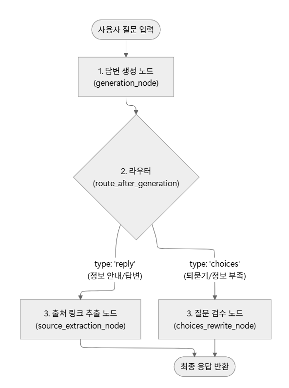
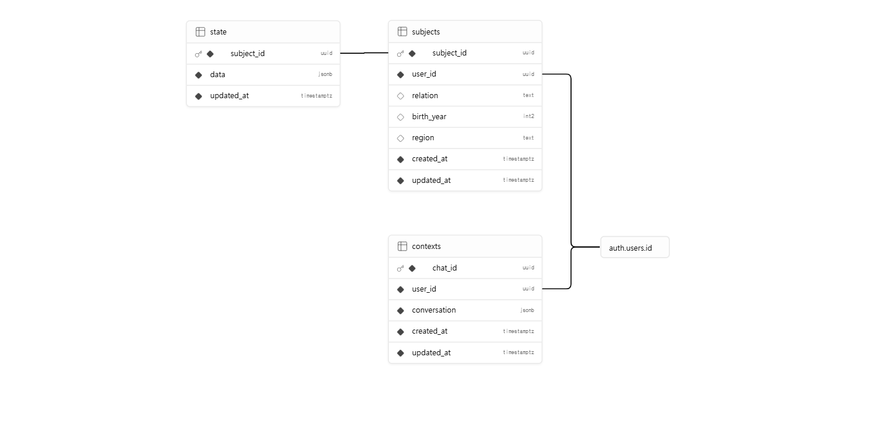

# 시스템 아키텍처 및 DB 설계

## 1. 시스템 아키텍처 구성도


전체 파이프라인은 LangGraph의 `StateGraph`로 구성되며, `START → generation → route_after_generation → (source_extraction | choices_rewrite) → END` 흐름으로 동작한다. `generation_node` 내부에서 LLM이 필요한 경우 tool을 스스로 호출하고 결과를 반영해 재판단하는 ReAct 루프를 수행하며, 라우터가 응답 type에 따라 후처리 노드를 분기한다.

---

## 2. LangGraph 그래프 구성 및 노드 역할

### 2.1 그래프 구조

```
START
  ↓
generation_node          # LLM + Tool 호출 (ReAct 루프)
  ↓
route_after_generation   # 조건부 분기 (라우터)
  ↙               ↘
source_extraction_node   choices_rewrite_node
  ↓               ↓
END             END
```

### 2.2 노드 역할

| 노드 | 구현 위치 | 역할 |
|---|---|---|
| `generation_node` | `server/agent.py` | 사용자 메시지를 받아 LLM이 tool 호출 여부를 판단하고 ReAct 루프를 수행한다. 응답은 `reply`(정보 안내) 또는 `choices`(되묻기) 두 가지 구조화된 형태로 출력된다. |
| `route_after_generation` | `server/agent.py` | `generation_node` 출력의 `type` 필드를 보고 `source_extraction` 또는 `choices_rewrite`로 분기하는 조건부 라우터다. |
| `source_extraction_node` | `server/agent.py` | `type: reply`일 때 실행된다. tool 실행 결과(ToolMessage)와 생성된 답변 텍스트를 보조 LLM에 전달해 출처(title, snippet, url)를 추출하고, URL 기준 중복 제거 후 최종 응답(`FinalReplyOutput`)을 반환한다. |
| `choices_rewrite_node` | `server/agent.py` | `type: choices`일 때 실행된다. 보조 LLM이 직전 대화 내역을 보고 되묻기 질문이 어색하거나 반복적이면 자연스러운 문장으로 수정한다. |

### 2.3 GraphState

```python
class GraphState(TypedDict):
    messages: Annotated[list[BaseMessage], operator.add]  # 전체 대화 메시지 (누적)
    structured_response: Optional[AgentOutput]            # generation_node 출력
    final_response: Optional[Union[FinalReplyOutput, ChoicesOutput]]  # 최종 응답
```

### 2.4 출력 형식



| type | 설명 | 최종 구조 |
|---|---|---|
| `reply` | 정보 안내·답변 완성 | `FinalReplyOutput` — `content.text` + `sources[]` (title/snippet/url) |
| `choices` | 정보 부족·되묻기 필요 | `ChoicesOutput` — `content.question` + `content.options[]` (label/value) |

### 2.5 Tool 구성

`generation_node` 내부 LLM에 bind되는 tool 목록이다. LangChain `@tool` 데코레이터로 구현되어 있다.

**GraphDB tool (`graph_db/graph_search_tool.py`) — 10개**

| tool | 설명 |
|---|---|
| `get_centers_by_sido` | 시도 기준 치매안심센터 목록 조회 |
| `get_centers_by_sigungu` | 시군구 기준 치매안심센터 목록 조회 |
| `get_sido_list` | 전국 시도 목록 조회 |
| `get_sigungu_list` | 특정 시도의 시군구 목록 조회 |
| `search_center_by_name` | 센터명 키워드로 검색 |
| `get_operator_by_center` | 센터명으로 운영기관 조회 |
| `get_centers_by_operator` | 운영기관명으로 센터 목록 조회 |
| `get_programs_by_center` | 센터명으로 제공 프로그램 조회 |
| `get_centers_by_program` | 프로그램 키워드로 센터 검색 |
| `flexible_graph_search` | 위 9개로 커버되지 않는 복합·예외 질의용 fallback (`GraphCypherQAChain`) |

**VectorDB tool (`vector_db/vector_search_tool.py`) — 1개**

| tool | 설명 |
|---|---|
| `search_dementia_guideline` | Qdrant에서 코사인 유사도 기반 가이드라인 검색. 유사도 0.3 미만 결과 제외. |

**기타 tool — 2개**

| tool | 구현 위치 | 설명 |
|---|---|---|
| `propose_state_change` | `server/extractor.py` | 대화 중 파악된 증상·기간·안전신호 등을 구조화된 슬롯으로 추출해 `StateManager`에 반영 |
| `query_family_info` | `server/family_tool.py` | Supabase에서 상담 대상자(subjects) 및 현재 상태(state) 정보를 조회 |

### 2.6 메모리 구조

| 구분 | 저장 단위 | 메커니즘 | 담는 내용 | 생명주기 |
|---|---|---|---|---|
| 단기 기억 | `thread_id` (세션) | LangGraph Checkpointer (Supabase) | 이번 세션의 대화 메시지, 진행 중인 슬롯 | 세션 종료 후 checkpoint는 남지만 다음 세션에 자동 연결되지 않음 |
| 장기 기억 | `user_id` + 대상자별 | Supabase (`subjects`, `state` 테이블) | 보호자 프로필, 대상자별 증상 이력, 안전신호 이력 | 여러 세션에 걸쳐 누적·참조 |

---

# 3. Database 설계

## 3.1 GraphDB (Neo4j) 설계

### 3.1.1 노드(Node) 및 프로퍼티

**`:시도`**

| 프로퍼티 | 타입 | 설명 |
|---|---|---|
| `name` | STRING | 시도명 (예: "서울특별시") |

**`:시군구`**

| 프로퍼티 | 타입 | 설명 |
|---|---|---|
| `name` | STRING | 시군구명 (예: "강남구") |
| `시도` | STRING | 소속 시도명 (동명 시군구 구분용, 예: "서울특별시") |

**`:치매안심센터`**

| 프로퍼티 | 타입 | 설명 |
|---|---|---|
| `센터ID` | STRING | 고유 식별자 |
| `name` | STRING | 센터명 |
| `유형` | STRING | 치매안심센터 / 광역치매센터 / 치매상담전화센터 |
| `시도`, `시군구` | STRING | 소재 지역 |
| `주소`, `우편번호` | STRING | 주소 정보 |
| `위도`, `경도` | FLOAT | 좌표 |
| `전화번호`, `팩스번호`, `홈페이지` | STRING | 연락처 |
| `설립일` | STRING | 개소일 |
| `의사인원수`, `간호사인원수`, `사회복지사인원수` | FLOAT | 핵심 인력 인원수 |
| `인원_임상심리사`, `인원_작업치료사`, `인원_물리치료사` 등 (15개 내외) | FLOAT | 표준 직종별 인원수 |

**`:운영기관`**

| 프로퍼티 | 타입 | 설명 |
|---|---|---|
| `운영기관ID` | STRING | 고유 식별자 |
| `name` | STRING | 운영기관명 (예: "삼성서울병원") |
| `대표자명` | STRING | 대표자 |
| `전화번호` | STRING | 연락처 |
| `홈페이지` | STRING | 운영기관 홈페이지 URL |

**`:프로그램`**

| 프로퍼티 | 타입 | 설명 |
|---|---|---|
| `프로그램ID` | STRING | 고유 식별자 |
| `name` | STRING | 프로그램명 |
| `category` | STRING | 표준 카테고리 (미분류 시 null) |
| `source` | STRING | 원본 데이터 출처 |
| `raw_text` | STRING | 파싱 전 원본 문구 |

### 3.1.2 관계(Relationship)

모든 관계는 단방향으로만 저장하며, 역방향 조회는 Cypher에서 화살표를 생략한 패턴(`-[:REL]-`)으로 처리한다.

| 관계 | 방향 | 개수 | 설명 |
|---|---|---|---|
| `LOCATED_IN` | `(:시군구) -> (:시도)` | 263 | 시군구가 속한 시도 |
| `LOCATED_IN` | `(:치매안심센터) -> (:시군구)` | 313 | 센터가 위치한 시군구 |
| `CONTAINS` | `(:시도) -> (:시군구)` | 263 | 시도가 포함하는 시군구 |
| `MANAGES` | `(:운영기관) -> (:치매안심센터)` | 271 | 운영기관이 관리하는 센터 |
| `PROVIDES` | `(:치매안심센터) -> (:프로그램)` | 1,309 | 센터가 제공하는 프로그램 |

### 3.1.3 제약조건 (Constraint)

MERGE 시 중복 방지 및 조회 성능을 위해 각 노드의 식별 프로퍼티에 uniqueness constraint를 설정했다.

| 노드 | 제약조건 |
|---|---|
| `:시도` | `name` UNIQUE |
| `:시군구` | `(시도, name)` UNIQUE |
| `:치매안심센터` | `센터ID` UNIQUE |
| `:운영기관` | `운영기관ID` UNIQUE |
| `:프로그램` | `프로그램ID` UNIQUE |

---

## 3.2 VectorDB (Qdrant) 설계

### 3.2.1 컬렉션 설정

| 항목 | 값 |
|---|---|
| 컬렉션명 | `dementia_guideline` |
| 임베딩 모델 | `text-embedding-3-small` |
| 벡터 차원 | 1,536 |
| 거리 척도 | Cosine |
| 총 청크 수 | 93 |

### 3.2.2 Point 구조

각 point는 청크 텍스트를 임베딩한 벡터와 아래 metadata(payload)로 구성된다.

| 필드 | 타입 | 설명 |
|---|---|---|
| `id` | UUID (결정론적 해시) | `출처 URL + 청크 순번 + 텍스트` 해시값. 재적재 시 동일 청크는 같은 id로 upsert되어 중복 방지 |
| `text` | STRING | 청크 원문 |
| `title` | STRING | 출처 문서 제목 |
| `source_url` | STRING | 출처 URL |
| `source_type` | STRING | 문서 유형 (`guideline` 고정) |
| `chunk_index` | INTEGER | 문서 내 청크 순번 |
| `total_chunks` | INTEGER | 해당 문서의 전체 청크 수 |

### 3.2.3 검색 파라미터

| 항목 | 기본값 | 설명 |
|---|---|---|
| `top_k` | 4 | 반환할 최대 청크 수 |
| `score_threshold` | 0.4 | 이 미만의 유사도 결과는 제외 |

---

## 3.3 RDB (Supabase / PostgreSQL) 설계

### 3.3.1 테이블 관계



```
auth.users (Supabase Auth 자동 생성)
     │
     ├─ 1:N ─▶ subjects ── 1:1 ─▶ state       (상담 대상자 → 현재 상태)
     │
     └─ 1:N ─▶ contexts                        (대화 세션 + 대화 내용)
```

스키마를 지배하는 두 가지 원칙:
1. 상담 대상은 사용자 본인이 아니라 **가족**(어머니 등) → 대상자(`subjects`)를 별도로 둠
2. 상담 내용은 **건강 민감정보** → 신원(`auth.users`)과 한 단계 떼어놓음

### 3.3.2 테이블 설명

**`subjects` — 상담 대상자**

| 컬럼 | 타입 | 설명 |
|---|---|---|
| `subject_id` | uuid (PK) | 대상자 고유 ID |
| `user_id` | uuid (FK → auth.users) | 등록한 사용자. 탈퇴 시 cascade 삭제 |
| `relation` | text | 사용자와의 관계 (예: '어머니', '아버지') |
| `birth_year` | int2 | 출생연도. 입력은 나이, 저장은 생년으로 변환 |
| `region` | text | 거주 지역. GraphDB 센터 조회 키로도 활용 |
| `created_at` | timestamptz | 등록 시각 |
| `updated_at` | timestamptz | 수정 시각 |

**`state` — 대상자의 현재 상태** (subjects와 1:1)

| 컬럼 | 타입 | 설명 |
|---|---|---|
| `subject_id` | uuid (PK, FK → subjects) | 1:1이라 PK 겸용 |
| `data` | jsonb | 상태 전체. 필터를 거친 값만 저장 |
| `updated_at` | timestamptz | 마지막 갱신 시각 |

`data` jsonb 구조 예시:
```json
{
  "symptoms": ["반복질문", "배회"],
  "duration": "1년쯤",
  "adl_impact": true,
  "safety_flags": [],
  "notes": ["duration 정정: 6개월 -> 1년쯤"]
}
```

**`contexts` — 대화 세션**

| 컬럼 | 타입 | 설명 |
|---|---|---|
| `chat_id` | uuid (PK) | 대화 세션 고유 ID |
| `user_id` | uuid (FK → auth.users) | 탈퇴 시 cascade 삭제 |
| `conversation` | jsonb | 대화 내용 (요약 + 최근 N턴) |
| `created_at` | timestamptz | 대화 시작 시각 |
| `updated_at` | timestamptz | 마지막 대화 시각 |

`conversation` jsonb 구조:
```json
{
  "summary": "보호자가 어머니의 반복질문·배회로 상담. 6개월 이상 지속.",
  "recent": [
    { "user": "어머니가 자꾸 같은 걸 물어요", "ai": "언제부터 그러셨나요?" },
    { "user": "한 1년 됐어요", "ai": "혹시 일상생활에 지장은 있으신가요?" }
  ]
}
```

### 3.3.3 핵심 설계 원칙

**환자 정보와 대화 맥락의 분리**

| 구분 | 테이블 | 특징 |
|---|---|---|
| 환자 정보 | `state` | 필터를 거친 정확한 값. LLM 판단의 근거 |
| 대화 맥락 | `contexts` | 요약 + 최근 N턴. 서사·흐름 보존용 |

환자의 핵심 정보는 `state`에 정확히 저장되므로, `contexts`가 요약으로 압축되어도 의학 판단에 영향이 없다.

**접근 제어 (RLS)**

| 테이블 | 정책 |
|---|---|
| `subjects` | `user_id = auth.uid()` 인 행만 |
| `state` | 해당 subject가 본인 것일 때만 |
| `contexts` | `user_id = auth.uid()` 인 행만 |

- **프론트엔드** (anon 키): RLS 적용, 자기 데이터만 접근
- **백엔드** (service_role 키): RLS 우회, 서버가 user 필터 직접 관리
- ⚠️ service_role 키는 절대 프론트엔드에 노출하지 말 것
